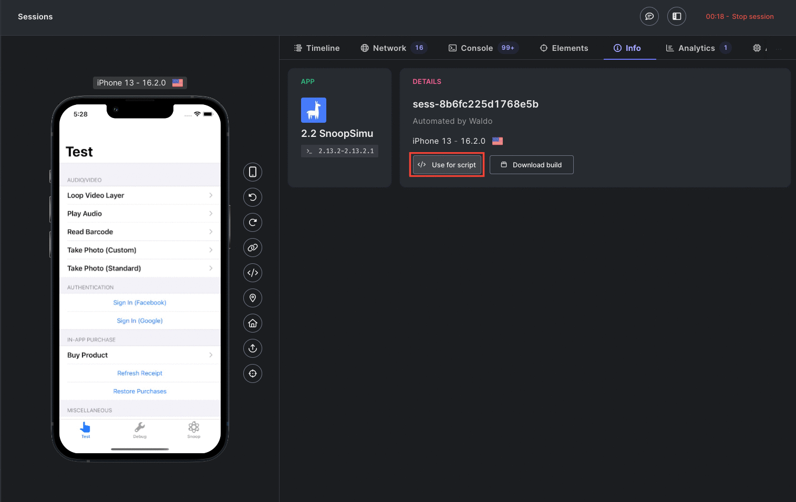

# Wikipedia automated testing with Waldo

## Introduction

This project is based on [WebdriverIO](https://webdriver.io/) targeting the Waldo infrastructure to run.

It shows some examples on how to automate tests on the open-source
application [Wikipedia](https://github.com/wikimedia/wikipedia-ios).

## Getting Started

Clone this repository, go to its root directory and run:

```shell
npm install
```

## First run

This repo has one test that talks to the Wikipedia app.

In order to run against the Waldo infrastructure, you always need an application token.

You can get it by going to `https://app.waldo.com/applications/ios/configurations/general`

You can either set it as the environment variable `WALDO_APP_TOKEN` or paste it in [wdio.conf.ts](wdio.conf.ts)

```shell
WALDO_APP_TOKEN=[YourToken] WALDO_APP_VERSION_ID=wiki-ios WALDO_SHOW_SESSION=1 npm run wdio
```

## Editing/Creating tests interactively

You can run your tests in interactive mode by using an existing Live session in Waldo.

Just start a Session in https://app.waldo.com/applications/ios/sessions?appVersionId=wiki-ios

You can then interact with the session in your browser and keep relaunching your script by reusing the same session and watching it live.

The parameters to run your scripts in interactive mode are easily retrievable in the `Info` tab of your Live Waldo session, by clicking the `Use for scipt` button.
This will copy the `WALDO_APP_TOKEN` and `WALDO_SESSION_ID` variables to your clipboard.



```shell
WALDO_APP_TOKEN=[YourToken] WALDO_SESSION_ID=[sessionId] npm run wdio
```
